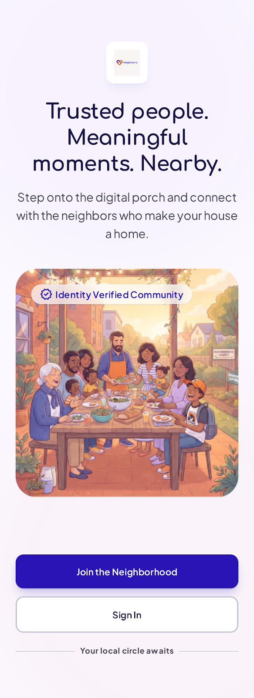
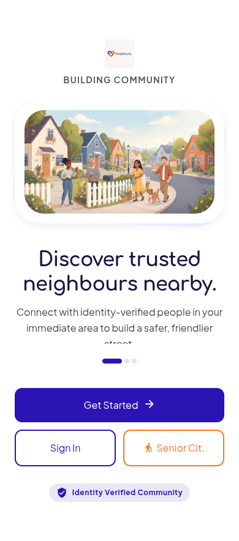
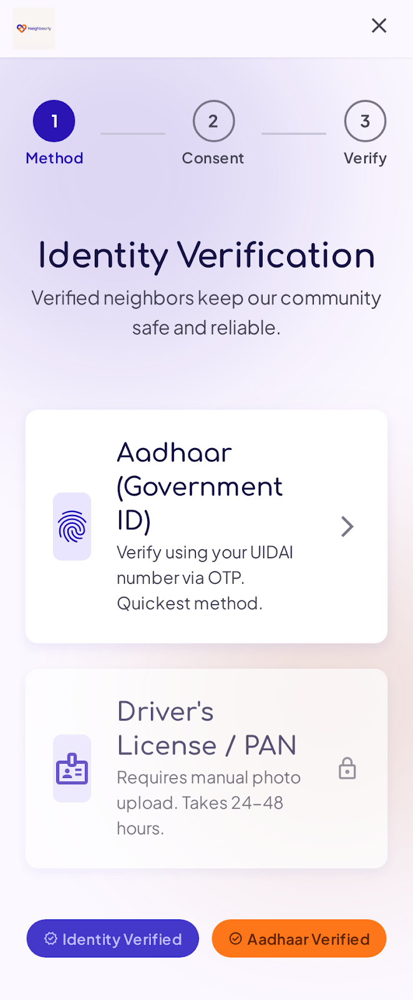
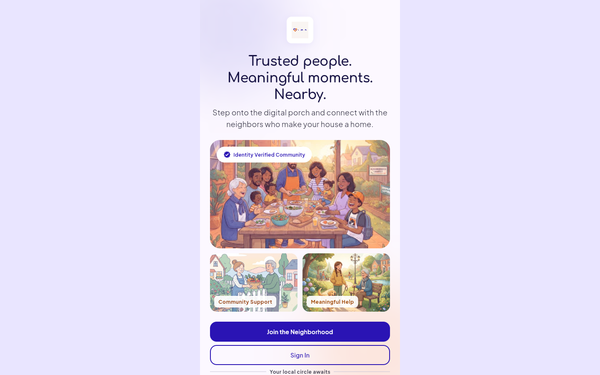

<div align="center">

# Nearood

**Trusted people. Meaningful moments. Nearby.**

A safe, identity-verified neighbourhood platform for discovering local events, offering and requesting assistance, and building real trust between neighbours - built with Flutter and Supabase.

[](https://flutter.dev)
[](https://supabase.com)
[](https://dart.dev)

</div>

---

## Overview

Nearood combines the best parts of local meetup platforms, neighbourhood communities, and trusted assistance services into a single, safety-first experience. Neighbours can host or join weekend dinners, walking groups, cultural events and skill-shares, or request/offer everyday help - grocery runs, senior companionship, local travel - with identity verification introduced exactly where it matters: the moment someone commits to meeting in person, not as a signup wall.

The product design originated as a set of high-fidelity Stitch mockups (see [Design Reference](#design-reference) below); this repository is the working Flutter implementation, wired to a live Supabase backend.

## Table of Contents

- [Design Reference](#design-reference)
- [Features](#features)
- [Tech Stack](#tech-stack)
- [Project Structure](#project-structure)
- [Database Schema](#database-schema)
- [Getting Started](#getting-started)
- [Running the App](#running-the-app)
- [Project Status](#project-status)

## Design Reference

The visual language - colour system, typography (Comfortaa + Plus Jakarta Sans), spacing and component shapes - comes from the original Stitch design mockups in [`Mockup/`](Mockup/), implemented faithfully in the Flutter app's [theme layer](app/lib/theme/). All four raw exports delivered for this project are below (two are alternate exports of the same Identity Verification screen).

<table>
<tr>
<td width="25%" align="center">

<br/><sub><b>Welcome</b></sub>
</td>
<td width="25%" align="center">

<br/><sub><b>Onboarding</b></sub>
</td>
<td width="25%" align="center">

<br/><sub><b>Identity Verification</b></sub>
</td>
<td width="25%" align="center">

<br/><sub><b>Identity Verification</b> (alt export)</sub>
</td>
</tr>
</table>


Full-resolution originals, along with the Stitch-generated `DESIGN.md` (design tokens) and `code.html` (reference markup) for each screen, are in [`Mockup/`](Mockup/).

<details>
<summary><b>Responsive layout</b> - mobile-first, letterboxed on desktop web rather than stretched</summary>
<br/>

</details>

## Features

### Onboarding & Identity
- Splash → Welcome → 3-slide onboarding carousel
- Email OTP sign-in/sign-up and Google OAuth via Supabase Auth
- Self-declared Aadhaar/government ID verification, requested **only at the moment it's needed** (requesting to join an event), not as a signup gate - submissions are queued for human review, not auto-approved (see [Trust & Safety](#trust--safety) note below)
- First-run neighbourhood selection via device geolocation or manual search (OpenStreetMap Nominatim)

### Discovery
- Home dashboard with live per-category event counts and photo tiles
- Explore feed sorted by real distance from the signed-in user's saved location
- Category-filtered browsing (tap a Home tile → filtered Explore list)
- Event details with host profile, live star rating, reviews, and "who this is for" eligibility tags (senior-friendly, women-only, family-friendly, accessibility support)

### Hosting
- Full event creation flow: category, title, description, location, date/time, capacity, free/paid pricing, eligibility tags
- Host dashboard listing all events you're running, with a live pending-request badge
- Request management per event - accept or reject each join request

### Trust & Safety
- Verification status (none / pending / approved / rejected) surfaced on Profile and gating join requests
- Floating safety (SOS) entry point from the main app shell
- Row Level Security enforced at the database layer for every table - see [Database Schema](#database-schema)

> **Note on identity verification:** real UIDAI/Aadhaar verification requires a licensed KYC provider (AUA/KUA) integration, which is out of scope for this build. The current flow captures a self-declared ID (last 4 digits only) for a human admin to review via the Supabase dashboard - it is intentionally **not** presented as a verified government check.

## Tech Stack

| Layer | Choice |
|---|---|
| Client | Flutter (Dart 3.12, Material 3), targeting Web/iOS/Android |
| Backend | Supabase - Postgres, Auth (Email OTP + OAuth), Row Level Security |
| Location | `geolocator` + OpenStreetMap Nominatim (free, no API key) |
| State | Lightweight `ChangeNotifier` session singleton - no external state management dependency |

## Project Structure

```
Neighbourly/
├── app/                        Flutter application
│   ├── lib/
│   │   ├── data/                Supabase repositories (events, host, verification)
│   │   ├── models/               Typed data models (Event, Review, JoinRequest, ...)
│   │   ├── screens/              One folder per feature area (auth, explore, host, ...)
│   │   ├── services/             Location service (geolocation + geocoding)
│   │   ├── state/                AppSession - auth + profile state
│   │   └── theme/                Colours, typography, spacing from the design system
│   ├── scripts/run.sh            Runs the app with Supabase credentials from .env.local
│   └── .env.local.example        Template for local Supabase credentials
├── supabase/
│   ├── schema.sql                 Full schema reference (profiles, events, join_requests, ...)
│   ├── migrations/                Incremental migrations, in order
│   └── seed/                      Demo data seed scripts (Admin API-based)
├── Mockup/                     Original Stitch design exports
└── docs/screenshots/           README assets
```

## Database Schema

Defined in [`supabase/schema.sql`](supabase/schema.sql) and applied incrementally via [`supabase/migrations/`](supabase/migrations/). Every table has Row Level Security enabled - see the SQL for exact policies.

| Table | Purpose |
|---|---|
| `profiles` | One row per user, auto-created on signup via trigger; verification status, location |
| `events` | Hosted events - category, schedule, pricing, location, eligibility tags |
| `join_requests` | A participant's request to join an event, with host-managed status |
| `verification_requests` | Self-declared ID submissions, queued for admin review |
| `reviews` | Post-event host ratings and comments |
| `host_ratings` | View aggregating average rating + review count per host |

## Getting Started

### Prerequisites
- [Flutter SDK](https://docs.flutter.dev/get-started/install) (3.x)
- A free [Supabase](https://supabase.com) project

### 1. Clone and install
```bash
git clone <this-repo>
cd Neighbourly/app
flutter pub get
```

### 2. Set up the database
In your Supabase project's SQL Editor, run [`supabase/schema.sql`](supabase/schema.sql), then each file in [`supabase/migrations/`](supabase/migrations/) in order.

Alternatively, via the Supabase CLI:
```bash
supabase login
supabase link --project-ref <your-project-ref>
supabase db push
```

### 3. Configure credentials
```bash
cp .env.local.example .env.local
```
Fill in your project's **URL** and **anon/public key** (Dashboard → Project Settings → API). These are the public client keys - safe by design, access is enforced by Row Level Security, not secrecy.

## Running the App

```bash
cd app
./scripts/run.sh -d chrome     # or -d <any other device>
```

The script reads `.env.local` and passes credentials via `--dart-define`, so no secrets are ever hardcoded in source.

### Tests & static analysis
```bash
flutter analyze
flutter test
```

## Project Status

Built as a functional, Supabase-backed implementation of the core loop (discover → verify → join → host → manage), rather than an exhaustive build of every screen in the original product spec. Not yet implemented: in-app chat, payments, the admin dashboard, senior citizen mode, and in-app review submission (reviews currently exist as seed data / are written server-side).

---

<div align="center">
<sub>Trust, privacy, and meaningful neighbourhood connections.</sub>
</div>
